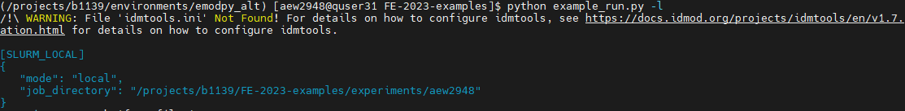
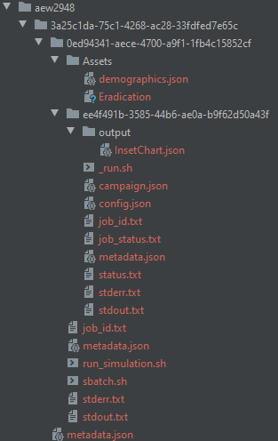

# FE-2023-examples
Exemples de scripts pour le programme d'enrichissement de la faculté de 2023 sur la modélisation appliquée du paludisme à Northwestern

[](https://github.com/numalariamodeling/FE-2023-examples/blob/main/README.md)
[](https://github.com/numalariamodeling/FE-2023-examples/blob/main/README.fr.md)

⚠️ - Conseils

❓ - Questions d'autocontrôle

➕ - Exercices bonus

### Volet technique (EMOD)

**Vue d'ensemble:**
Les exercices consistent généralement aux objects de simulation et analyzer des résultats de la simulation. Au cours des semaines, des scripts supplémentaires existent pour préparer les entrées de simulation ou générer des sorties et des tracés supplémentaires, ou pour la calibration du modèle, comme décrit dans les instructions pour les semaines respectives.

**Scripts fournis et vérification des résultats:**.
Quelques scripts principaux sont fournis au niveau principal de ce référentiel, y compris des exemples d'exécution et de l'objet analyzer. La plus grande partie du travail pour ce cours sera effectuée par vous en construisant vos propres scripts basés sur les instructions avec l'aide de ces scripts. Pour chaque semaine, des scripts de simulation suggérés à des fins de comparaison ou d'aide pendant l'exercice sont fournis dans le dossier [scripts de solution](https://github.com/numalariamodeling/FE-2023-examples/tree/main/solution_scripts) de la semaine concernée. Les scripts de solution contiennent également un fichier de collection de l'objet analyzer qui comprend de nombreux objets analyzers couramment utilisés et que vous pourriez vouloir explorer plus en profondeur dans le cadre de votre projet. 

*Remarque: si vous utilisez un objet analyzer de la collection, assurez-vous d'ajouter les rapporteurs appropriés pour créer les fichiers de sortie nécessaires.*

**Prérequis:** 
L'exécution de vos scripts nécessite que l'environnement virtuel emodpy soit chargé et suppose que les fichiers soient exécutés à partir d'un répertoire de travail situé à l'endroit où se trouve le script. Créez cet environnement à l'aide des [instructions d'installation](https://numalariamodeling.github.io/FE-2023-quarto-website/guides/install_guide.html). Nous vous recommandons de créer un dossier "environments" dans votre répertoire personnel et d'y créer l'environnement. 

Vous devrez également configurer votre fichier `.bashrc` (situé dans votre répertoire personnel). Nous utilisons ce fichier pour charger automatiquement les modules, tels que python, qui sont nécessaires au fonctionnement d'EMOD. Nous pouvons inclure un alias pour l'environnement virtuel décrit ci-dessus. Le modèle ci-dessous crée une commande alias appelée `load_emodpy` que nous pouvons exécuter dans le terminal pour activer l'environnement virtuel emodpy - mettez à jour la commande d'activation pour refléter l'environnement que vous avez créé à l'étape précédente. 

Cliquez sur la flèche pour développer:
<details><summary><span><em>Template `.bashrc` file</em></span></summary>
<p>

Ce modèle peut être copié directement dans votre fichier `.bashrc` sur QUEST: 

```bash
# .bashrc

# Définitions globales de la source
if [ -f /etc/bashrc ] ; then
	. /etc/bashrc
fi

# Décommentez la ligne suivante si vous n'aimez pas la fonction de pagination automatique de systemctl:
# export SYSTEMD_PAGER=

# Alias et fonctions spécifiques à l'utilisateur
alias load_emodpy='source /home/<user>/environments/<emodpy-venv>/bin/activate'
module purge all
module load singularity/3.8.1
module load git/2.8.2
module load python/3.8.4
module load R/4.1.1
```

</p>
</details>

Avant d'exécuter les scripts d'exemple hebdomadaires, veuillez vous assurer que l'environnement virtuel emodpy a été chargé avec succès et que ce [répertoire a été cloné](https://docs.github.com/en/repositories/creating-and-managing-repositories/cloning-a-repository) dans le répertoire du projet sur QUEST, idéalement sous la forme */projects/b1139/FE_<username>/FE-2023-examples*.

- Naviguez vers le projet: `cd /projects/b1139`
- Créez votre répertoire personnel pour le programme: `mkdir FE_<nom d'utilisateur>` puis naviguez-y en utilisant `cd FE_<nom d'utilisateur>`.
- Clonez ce répertoire avec votre adresse ssh pour le dépôt. Cliquez sur le bouton vert "code" ci-dessus et copiez l'adresse ssh puis exécutez ce qui suit sur QUEST: `git clone <adresse ssh>`
	
Avant de commencer un exercice, assurez-vous d'avoir récupéré les dernières modifications du répertoire (voir git-guides [git-pull](https://github.com/git-guides/git-pull)).
	
Pour plus d'aide sur l'utilisation de SLURM sur QUEST, consultez [ressources ](https://numalariamodeling.github.io/FE-2023-quarto-website/resources/coding_resources/quest_resources.html) sur le site web du programme.

## Semaine 1: Vue d'ensemble d'EMOD
Cette semaine, nous discuterons de la structure générale et du contenu d'EMOD et nous nous assurerons que vous êtes prêts à exécuter le modèle sur notre HPC linux, QUEST. Vous allez mettre en place votre propre environnement virtuel pour exécuter EMOD via emodpy et idmtools et cloner ce répertoire github dans votre répertoire FE sur notre allocation de projet QUEST, b1139. Veuillez vous familiariser avec le répertoire, le site web et la documentation EMOD avant d'exécuter l'exemple simple à la fin de cette semaine.

**Objectifs à atteindre**

Cliquez sur la flèche pour agrandir:
<details><summary><span><em>Exécuter EMOD à partir du terminal</em></span></summary>
<p>

Lorsque vous exécutez un script de simulation EMOD sur QUEST, il génère une série de messages initiaux. Vous verrez un avertissement concernant l'absence de "idmtools.ini" - c'est tout à fait normal car nous n'avons généralement pas besoin du fichier ini pour fonctionner avec emodpy. Après cet avertissement, vous verrez un segment qui vous donne quelques informations de base sur la plateforme idmtools que vous utilisez pour exécuter le script ainsi que le répertoire de travail, où tous les résultats de votre simulation seront stockés.



Après une courte période d'attente, vous verrez également des lignes supplémentaires fournissant des informations sur la mise en service de votre/vos simulation(s). Vous pouvez vous attendre à voir une ligne indiquant que la tâche EMODTask est en cours de création, quelques avertissements et avis concernant la création de fichiers, puis les barres indiquant la progression de la découverte des actifs et de la mise en service de la simulation. Une fois la mise en service terminée, vous verrez également l'ID de la tâche QUEST, le répertoire de la tâche, l'ID de la suite et l'ID de l'expérience. Une ligne dans le fichier [run_example.py](https://github.com/numalariamodeling/FE-2023-examples/blob/main/run_example.py) indique au terminal d'attendre que toutes les simulations soient terminées. Il y a donc une barre de progression supplémentaire et l'affirmation que l'expérience a réussi ou échoué (une fois terminée) qui peut ne pas être présente dans toutes les exécutions si cette ligne est exclue. Notez que nous avons commandé et exécuté avec succès une simulation ici (voir 1/1 à la fin des barres de progression).


</p>
</details>

<details><summary><span><em>Structure du fichier</em></span></summary>
<p>

Si vous vous rendez dans le répertoire du travail, la structure du fichier devrait ressembler à celle ci-dessous. Elle peut être résumée comme suit:

- Répertoire des emplois
    - ID de la suite
        - ID de l'expérience
            - Actifs de l'expérience (par exemple, données démographiques, exécutable EMOD, fichiers climatiques, etc.)
            - Identifiant(s) de simulation
                - Dossier de sortie (par exemple, rapporteurs spécifiés dans le script d'exécution)
                - Sorties générales de la simulation (par exemple, fichiers de campagne et de configuration, suivi de l'état/des erreurs, métadonnées de la simulation)
            - Sorties générales de l'expérience (par exemple, suivi de l'état et des erreurs, métadonnées de l'expérience)
        - Fichier de métadonnées de la suite
            
*Note: Tous les dossiers ID sont des chaînes alphanumériques à 16 chiffres générées par idmtools, il n'y a actuellement aucun moyen de les modifier pour utiliser des noms plus lisibles par l'homme.*



</p>
</details>

**Exemple**

L'exercice de cette semaine présente la version la plus simple de l'exécution et de l'analyse d'une expérience de simulation unique dans EMOD en utilisant l'infrastructure emodpy/idmtools et python. Avant d'exécuter une simulation, il faut vérifier que toutes les configurations et installations ont été effectuées avec succès et modifier les chemins dans le fichier manifeste. Les étapes sont généralement les suivantes

1. exécuter la simulation, et   
2. analyser les résultats de la simulation 

**Instructions**

Cliquez sur la flèche pour agrandir:
<details><summary><span><em>Exécuter une simulation EMOD simple</em></span></summary>
<p>

- Naviguez vers votre copie locale de ce répertoire sur QUEST: `cd /projects/b1139/FE_<username>/FE-2023-examples`  
- Notez le chemin de votre répertoire de travail dans `manifest.py`: `/projects/b1139/FE_<username>/FE-2023-examples/experiments/`. Cela vous aidera à suivre vos simulations séparément des autres participants.
    - *Note: chaque fois que vous voyez des éléments entre `< >`, ils doivent être remplacés ENTIÈREMENT par ce qui est étiqueté comme étant l'élément en question. Par exemple, si votre nom d'utilisateur est `abc123`, ce répertoire de travail sera:* `/projects/b1139/FE_abc123/FE-2023-examples/experiments`
- Chargez votre environnement virtuel emodpy (voir les prérequis)  
- Lancez la simulation via `python3 run_example.py`
- Attendez que la simulation se termine (~2 minutes)  
- Allez dans le répertoire job (voir `experiments` ci-dessus) pour trouver l'expérience générée - elle sera sous un ensemble de chaînes alphanumériques de 16 chiffres. La structure de ces chaînes est `Suite > Experiment > Simulations`. En raison des systèmes de gestion actuels de SLURM, vous ne pourrez pas voir le nom de l'expérience donné dans le script `run_example.py` ; cependant, il peut être trouvé dans les fichiers metadata.json au niveau de l'expérience et de la simulation. Vous pouvez également choisir de trier vos fichiers en fonction du temps, de sorte que les expériences les plus récentes apparaissent en premier. 
- Jetez un coup d'œil à ce qui a été généré, même dans cette simple exécution, et familiarisez-vous avec la structure des fichiers. Vous devez toujours vérifier vos résultats au niveau de la simulation après avoir exécuté les simulations pour vous assurer qu'elles ont donné les résultats escomptés. 
    - *Remarque: assurez-vous d'aller jusqu'au bout de la structure des dossiers pour voir vos simulations et leurs résultats. Pour plus d'informations sur ce à quoi il faut s'attendre, voir [Semaine 1 "Ce à quoi on peut s'attendre"](https://github.com/numalariamodeling/FE-2023-examples/blob/main/README.fr.md#semaine-1-vue-densemble-demod)*.
    - Vous devriez voir [`InsetChart.json`](https://docs.idmod.org/projects/emod-malaria/en/latest/software-report-inset-chart.html) dans le dossier de sortie de la simulation - c'est le rapport par défaut d'EMOD qui vous donnera une idée de ce qui se passe dans votre simulation. Nous allons maintenant faire une analyse basique de ces données.
- Copiez l'UID de l'expérience, situé dans le fichier `metadata.json` au niveau de l'expérience. Mettez à jour le nom de l'expérience pour qu'il corresponde à celui utilisé ci-dessus et collez l'UID de l'expérience dans le dictionnaire "expts" (ligne 71) de `analyzer_W1.py` (situé au niveau principal du référentiel avec les autres scripts fournis). Cela devrait ressembler aux exemples ci-dessous et dans le script. 
    - *Astuce: Si vous n'êtes pas sûr de savoir quelles sont les métadonnées de l'expérience, vérifiez le "item_type" et le "name" dans le fichier - disent-ils "experiment" et le nom que vous attendez de votre expérience, respectivement? Si c'est le cas, vous êtes dans le bon fichier de métadonnées et vous pouvez trouver l'UID en bas. Si vous êtes toujours bloqué, relisez [la semaine 1 "Ce à quoi on peut s'attendre"](https://github.com/numalariamodeling/FE-2023-examples/blob/main/README.fr.md#semaine-1-vue-densemble-demod) sur la structure des fichiers.
	
```python
    expts = {
        '<nom de l'expérience>' : '<ID de l'expérience>'
    }
```
- Sauvegardez et lancez l'analyzer en utilisant `python3 analyzer_W1.py` sur la ligne de commande. Nous verrons plus en détail la semaine prochaine comment fonctionnent les objets analyzers EMOD et ce que vous pouvez faire avec eux.
- Lorsque l'analyzer a fini de fonctionner, naviguez jusqu'au répertoire de travail dans lequel vous avez sauvegardé vos résultats (*Ressort: vérifiez la ligne 76 pour commencer à identifier où cela pourrait être*) et vérifiez la sortie de cet analyzer - il devrait y avoir un fichier appelé "All_Age_Inset_Chart.csv".
- Si le fichier a été créé avec succès, nous pouvons tracer quelques données de base sur la simulation. Nous utiliserons RStudio sur les [QUEST Analytics Nodes](https://rstudio.questanalytics.northwestern.edu/) pour exécuter le traceur, mais vous pouvez également choisir de télécharger votre fichier de sortie et d'exécuter RStudio localement. 
    - Une fois connecté à RStudio de QUEST, vous pouvez naviguer vers ce dépôt en cliquant sur `Session` (dans la barre d'outils) > `Set Working Directory` > `Choose Directory` > `...` > tapez `/projects/b1139/FE_<username>/FE-2023-examples` > `Choose`
- Ouvrez `plot_InsetChart.Rmd`, mettez à jour les chemins pour qu'ils correspondent à votre répertoire de sortie (`root`) et au `sous-dossier` de l'expérience (qui devrait être le nom de l'expérience fourni à l'analyzer) où se trouve le fichier "All_Age_Inset_Chart.csv".

```r
root <- "<répertoire de sortie>"
sous-dossier <- "<nom de l'expérience>"
```
- En haut à droite de chaque bout de code, il y a un petit triangle vert - qui lancera le bout correspondant lorsqu'il sera cliqué. Exécutez le premier bout pour charger les bibliothèques (lignes 8-12). Si vous obtenez une erreur indiquant que les bibliothèques sont manquantes, utilisez `install.packages("<nom de la bibliothèque>")` pour les installer et réessayer de les charger. Une fois qu'elles sont chargées, exécutez le bout de code du traceur (lignes 14-85). Vérifiez les tracés sauvegardés dans votre répertoire output.
    - Ce traceur produit quatre groupes de canaux `InsetChart` se rapportant généralement à l'incidence, la prévalence, le climat/les vecteurs, et la population/la démogaphie. Explorez chacun des ensembles de graphiques et voyez ce que vous pouvez apprendre sur cette première simulation!
    - *Remarque: ces graphiques peuvent être utiles pour diagnostiquer les performances de votre simulation, par exemple pour surveiller les niveaux de population ; cependant, ils ne doivent pas être utilisés pour présenter des résultats, car il s'agit simplement d'un exemple de visualisation qui n'est pas destiné à répondre à des questions spécifiques.*
	
</p>
</details>

## Semaine 2: Les éléments de base

Le premier exercice de cette semaine montre comment créer des fichiers d'entrée, tels que des fichiers démographiques et climatiques, et comment les incorporer dans la simulation. L'exercice explique également comment modifier les paramètres de configuration (par exemple, la taille de la population ou la durée de la simulation).

Le deuxième exercice de cette semaine se concentre sur l'ajout de rapporteurs et l'observation des changements dans les résultats de simulation basés sur les sorties des modèles `InsetChart.json` et `MalariaSummaryReport.json`.

**Instructions**

Cliquez sur la flèche pour développer:
<details><summary><span><em>Ajouter des entrées</em></span></summary>
<p>

Cet exercice montre comment créer des fichiers démographiques et climatiques et comment les incorporer dans la simulation. Il montre également comment modifier les paramètres de configuration (par exemple, le nombre d'exécutions ou la durée de la simulation). Effectuez toutes les étapes ci-dessous avant d'exécuter l'exemple suivant.


1. Extraire les données climatiques et les ajouter aux simulations
    - Consultez le fichier `example_site.csv` dans le [dossier inputs](https://github.com/numalariamodeling/FE-2023-examples/tree/main/inputs). Ce fichier contient les coordonnées d'un site d'exemple en Ouganda et établit que ce site sera notre "Node 1" dans le modèle. Vous pouvez utiliser ces coordonnées ou sélectionner un site différent (et ajuster les coordonnées en conséquence) si vous le souhaitez pour le reste de cet exemple.
    - Ensuite, nous allons lancer `extract_weather.py` - ce script va lancer le générateur de météo. Notez qu'il lit les informations de `example_site.csv` pour trouver le bon site et vous pouvez demander la météo pour la période qui vous intéresse. Vous verrez également que la plateforme utilisée s'appelle *Calculon* - il s'agit du HPC de l'IDM _(nécessite un accès à la base de données climatiques: demandez à quelqu'un de l'équipe NU)_.
        - Nous pouvons également lancer `recreate_weather.py` qui convertira les fichiers météo que nous venons de générer dans un format csv que nous pourrons modifier. Pour cet exemple, nous n'avons pas besoin de faire de modifications, mais cela peut être utile pour des questions de recherche telles que celles liées au changement climatique. Après avoir effectué toutes les modifications dans le script, nous reconvertissons les csv en fichiers météorologiques.  
    - Maintenant que vous savez ce que font les scripts, chargez votre environnement virtuel et utilisez `python3 extract_weather.py` pour lancer l'extraction.   
        - Entrez vos identifiants pour accéder à Calculon et attendez que vos fichiers météo soient générés. Lorsque c'est terminé, vérifiez les entrées de votre repo pour vous assurer que les fichiers ont bien été créés.   
        - Lancez ensuite `python3 recreate_weather.py` et vérifiez que les fichiers météo modifiés ont été créés. Assurez-vous de vérifier le script `recreate_weather.py` pour voir où ils devraient être situés.
    - Copiez `run_example.py` et nommez le `run_example_inputs.py` et dans le script changez le nom de l'expérience en `f'{utilisateur}_FE_example_inputs'`
    - Mettez à jour les paramètres par défaut dans votre script de simulation (`run_example_inputs.py`)'s `set_param_fn()`. Vous aurez aussi besoin d'ajouter votre dossier de fichiers climatiques comme répertoire d'actifs à la tâche EMODTask dans `general_sim()`, cela doit être fait après que la tâche soit définie et avant que l'expérience ne soit créée. Il est recommandé de placer ce répertoire après le "set sif":

    ```python
    def set_param_fn():
        ## contenu existant
        config.parameters.Air_Temperature_Filename = os.path.join('climate',
            'example_air_temperature_daily.bin')
        config.parameters.Land_Temperature_Filename = os.path.join('climate',
            'example_air_temperature_daily.bin')
        config.parameters.Rainfall_Filename = os.path.join('climate',
            'example_rainfall_daily.bin')
        config.parameters.Relative_Humidity_Filename = os.path.join('climate', 
            'example_relative_humidity_daily.bin')

    ```
    ```python
    def general_sim():   
        ## contenu existant
        task.set_sif(manifest.SIF_PATH, platform)
    
        # ajoute le répertoire météo en tant qu'actif
        task.common_assets.add_directory(os.path.join(manifest.input_dir,
            "example_weather", "out"), relative_path="climate")
    ```

2. Ajouter des données démographiques
    - Vous avez peut-être remarqué la fonction `build_demog()` dans le premier exemple, nous allons maintenant l'examiner plus en détail. Il y a plusieurs façons d'ajouter des détails démographiques à nos simulations, principalement avec un nouveau générateur où nous ajoutons des détails au fur et à mesure ou à partir d'un csv ou nous pouvons lire un fichier json pré-fait. Ici, nous allons utiliser la commande `from_template_node` dans emodpy_malaria demographics avec quelques informations de base, comme la latitude et la longitude. Nous devons importer cette fonctionnalité directement depuis emodpy_malaria - vous devriez le voir en haut de votre script
    - Dans la fonction `build_demog()`, vous devriez voir la commande template node, ajouter la latitude et la longitude pour votre site d'exemple et augmenter la taille de l'échantillon à 1000.
    - Nous voulons également ajouter la dynamique vitale d'équilibre à notre script. Cela permettra d'égaliser les taux de natalité et de mortalité afin d'obtenir une population relativement stable dans nos simulations. Pour certaines expériences, il peut être souhaitable de définir ces taux séparément, mais pour l'instant, cette version simple répondra à nos besoins. Ajoutez `SetEquilibriumVitalDynamics()` directement au fichier de démographie que nous créons dans la fonction de génération (comme on le voit ci-dessous).
    - Il existe de nombreux aspects de la démographie que nous pouvons spécifier, tels que la dynamique vitale mentionnée précédemment, les distributions de risque et les distributions d'âge. L'emod_api contient des distributions d'âge existantes. Nous allons devoir importer ces distributions prédéfinies et les ajouter avec `SetAgeDistribution` à notre fichier de démographie. Essayons d'ajouter la distribution générale pour l'Afrique sub-saharienne.
    
    ```python
    import emodpy_malaria.demographics.MalariaDemographics as Demographics
    import emod_api.demographics.PreDefinedDistributions as Distributions

    def build_demog():
        """
        Cette fonction construit un fichier d'entrée démographique pour le DTK en utilisant emod_api.
        """

        demog = Demographics.from_template_node(lat=0.4479, lon=33.2026,
                                                pop=1000, name="Site_Exemple")
        demog.SetEquilibriumVitalDynamics()
    
        age_distribution = Distributions.AgeDistribution_SSAfrica
        demog.SetAgeDistribution(age_distribution)

        return demog
    ```

3. Modifier les configurations
    - Nous souhaitons souvent modifier certains des [paramètres de configuration](https://docs.idmod.org/projects/emod-malaria/en/latest/parameter-configuration.html) qui contrôlent des éléments tels que le modèle intra-hôte, les vecteurs et la configuration de la simulation. Dans `run_example.py` nous définissons les valeurs par défaut de l'équipe paludisme en utilisant `config = conf.set_team_defaults(config, manifest)`, mais nous pouvons aussi spécifier des paramètres individuels comme nous l'avons fait avec les noms des fichiers climatiques. Commençons par des choses simples comme l'ajout du réglage de la `Simulation_Duration` (la durée de la simulation en jours) et du `Run_Number` (la graine aléatoire pour la simulation) dans `set_param_fn()`. Ces deux paramètres peuvent être utilisés directement en les référençant comme `config.parameters.<param_name>` et en les réglant à la valeur désirée. L'équipe utilise généralement une structure de `sim_years*365` avec sim_years défini globalement, en haut du script sous toutes les importations, pour définir la durée.
    - Fixez la durée à 1 an et le numéro d'exécution à n'importe quel nombre de votre choix
        - *Note: cette valeur est juste la valeur de la graine aléatoire, PAS le nombre de réalisations stochastiques à exécuter.*
    - Ensuite, nous allons ajouter quelques espèces de moustiques. Il existe une fonction spécifique pour cela, `add_species()` dans emodpy_malaria malaria config. Essayez d'ajouter *A. gambiae*, *A. arabiensis*, et *A. funestus* à votre fichier de configuration:
        
    ```python    
    sim_years = 1

    def set_param_fn():
        ## contenu existant
    
        conf.add_species(config, manifest, ["gambiae", "arabiensis", "funestus"])

        config.parameters.Simulation_Duration = sim_years*365
        config.parameters.Run_Number = 0
    ```

4. Maintenant que vous avez ajouté ces changements, essayez d'exécuter votre nouveau script avec `python3 run_example_inputs.py`. Une fois qu'il a réussi, allez vérifier ce qui s'est exécuté. Voyez-vous les changements dans votre demographics.json et le dossier climate dans le répertoire `Assets` de l'expérience? Et dans config.json ou stdout.txt? 

</p>
</details>


<details><summary><span><em>Ajouter des sorties</em></span></summary>
<p>

Cet exercice montre comment ajouter à nos simulations certains des rapports intégrés sur le paludisme. Ces rapports peuvent nous aider à comprendre ce qui se passe dans nos simulations, qu'il s'agisse d'objectifs de base tels que l'incidence et la prévalence ou d'images plus détaillées d'événements ou de données internes à l'hôte telles que la parasitémie. Vous pouvez en savoir plus sur les types d'analyseurs possibles dans la [documentation du fichier de sortie EMOD](https://docs.idmod.org/projects/emod-malaria/en/latest/software-outputs.html). Dans cet exercice, nous allons ajouter l'enregistreur de rapport d'événement et le rapport de synthèse sur le paludisme aux simulations.

- Copiez votre script `run_example_inputs.py` et nommez-le `run_example_outputs.py`. Changez le nom de l'expérience en `f'{user}_FE_example_outputs'`.
- Nous devons importer les reporters du paludisme depuis emodpy_malaria. Vous devrez ajouter cette ligne au reste de vos importateurs emodpy_malaria `from emodpy_malaria.reporters.builtin import *` au début de votre script. Remarquez le "*" à la fin, cela signifie que nous importons tous les reporters du script de reporter intégré par leurs noms.
- [Report Event Recorder](https://docs.idmod.org/projects/emod-malaria/en/latest/software-report-event-recorder.html) nous permet de voir les différents événements qui se produisent pour chaque individu dans notre sim, ainsi que des informations démographiques et de santé de base sur l'individu. Ce rapport est particulièrement utile pour le suivi de différentes interventions, telles que l'administration d'un traitement, mais pour l'instant, nous nous contenterons d'examiner des événements simples tels que les naissances ou les anniversaires d'individus existants. Nous pouvons contrôler la période sur laquelle nous voulons faire le rapport, de `start_day` à `end_day`, ainsi que des choses comme le groupe d'âge cible et les nœuds pendant que nous ajoutons le rapporteur. Pour l'instant, ajoutons le rapport pour l'ensemble de la simulation et en ciblant les âges de 0 à 100 ans, donc probablement toute la population. Il peut être ajouté à notre `general_sim()` avec `add_event_recorder()` après que la tâche ait été définie, autour de la ligne 110:
    
    ```python
    def general_sim():
        ## contenu existant
    
        add_event_recorder(task, event_list=["HappyBirthday", "Births"],
                           start_day=1, end_day=sim_years*365, 
                           node_ids=[1], min_age_years=0,
                           max_age_years=100)
    ```

- [Malaria Summary Report](https://docs.idmod.org/projects/emod-malaria/en/latest/software-report-malaria-summary.html) fournit un résumé des données sur le paludisme au niveau de la population, regroupées en différentes catégories telles que l'âge, la parasitémie et l'infectiosité. Ce rapport nous fournira des informations telles que la PfPR, l'incidence clinique et la population stratifiée dans le temps (ainsi que les tranches d'âge, la parasitémie et l'infectiosité si vous le souhaitez). Nous pouvons spécifier la période d'agrégation qui nous intéresse, typiquement hebdomadaire, mensuelle ou annuelle par l'intermédiaire de l'intervalle de rapport. La documentation liée vous montrera beaucoup d'autres choses que nous pouvons spécifier aussi, mais pour l'instant nous allons garder les choses simples et définir notre rapport à exécuter mensuellement pour la durée de la simulation avec des groupes d'âge simples: 0-0.25, 0.25-5, et 5-115 ans. Nous allons également indiquer au rapport que nous voulons un maximum de 20 intervalles afin d'être sûrs d'obtenir tous nos rapports mensuels pour 1 an et utiliser `pretty_format` pour rendre le rapport de sortie plus lisible pour nous. Vous devez également ajouter un suffixe au nom de fichier, dans ce cas nous utiliserons "monthly" pour donner une description supplémentaire au rapport. Ceci doit être ajouté directement après le Report Event Recorder, également dans `general_sim()` avec `add_malaria_summary_report()`: 
    
    ```python
    def general_sim():
        ## contenu existant
    
        ## enregistreur d'événements précédemment ajouté
    
        add_malaria_summary_report(task, manifest, start_day=1, 
                                   end_day=sim_years*365, 
                                   intervalle_de_rapport=30,
                                   age_bins=[0.25, 5, 115],
                                   max_number_reports=20,
                                   filename_suffix='monthly',
                                   pretty_format=True)
    ```
   
- Essayez d'exécuter votre nouveau script comme vous l'avez appris dans les deux derniers exemples et attendez qu'il se termine avant de naviguer dans votre répertoire d'expérimentation. Une fois l'exécution terminée, vérifiez les résultats de la simulation et votre nouveau rapport. Vérifiez que les fichiers ont bien été créés et regardez ce qu'ils contiennent. Que remarquez-vous?
    - *Conseil: il est particulièrement important de vérifier tous vos résultats lorsque vous apportez des modifications importantes à votre script. Si vous ne les examinez pas, vous risquez de passer à côté de problèmes qui ne sont pas à l'origine de l'échec de vos simulations (mais qui font quelque chose que vous ne voulez pas qu'ils fassent).*

</p>
</details>


<details><summary><span><em>Analyse</em></span></summary>
<p>

Maintenant que vous avez appris les bases de l'exécution d'EMOD et de l'ajout d'entrées/sorties, vous pouvez commencer à analyser des données! Nous utilisons des scripts d'analyse pour extraire les données que nous voulons des rapports de nos simulations afin de comprendre ce que fait la simulation, comment elle évolue et de répondre aux questions de recherche. Le script d'analyse de cette semaine, `analyzer_W2.py` contient deux analyseurs différents:

1. `InsetChartAnalyzer` qui extrait les données de `Inset_Chart.json`. Notez le `channels_inset_chart` à la ligne 164 - il indique quels canaux de données nous sommes intéressés à regarder. Six canaux différents sont actuellement inclus, mais ils peuvent toujours être modifiés en fonction de ce que vous voulez explorer. Il s'agit d'une version modifiée de l'analyseur de graphiques en incrustation simple qui extrait tous les canaux de la semaine 1.
2. L'analyseur `MonthlyPfPRAnalyzer` qui extrait les données du rapport mensuel. Si vous regardez la structure de l'analyseur (lignes 63 - 140), vous verrez qu'il se concentre particulièrement sur l'extraction de la PPR, de l'incidence clinique (par personne et par an), de l'incidence sévère (par personne et par an) et de la population, le tout par tranches de temps (mois, année) et d'âge.

- Les deux analyseurs comprennent des années de début pour faire correspondre le temps de simulation au temps réel. Vous pouvez fournir toutes les valeurs pertinentes qui seront utiles à votre traitement (comme 2000 - 2009 pour une simulation de 10 ans).
- Vous remarquerez également que les `sweep_variables` sont définies et introduites dans les deux analyseurs - nous en discuterons plus en détail au cours de la semaine 3, mais pour l'instant vous pouvez considérer cela comme une étiquette (ou un ensemble d'étiquettes) pour notre (nos) simulation(s). Ces étiquettes de variables de balayage sont utiles pour regrouper les simulations à des fins d'agrégation et pour comprendre les différences entre elles. 
    - Parce que nous n'utilisons que le "Run_Number" (graine aléatoire pour la réalisation stochastique) dans l'exemple de cette semaine, vous pouvez voir un message d'avertissement: `FutureWarning: In a future version of pandas, a length 1 tuple will be returned when iterating over a groupby with a grouper equal to a list of length 1. Don't supply a list with a single grouper to avoid this warning.` Cet avertissement est juste pour dire qu'il est préférable de fournir plus d'une variable pour le groupage.

- Avant de pouvoir exécuter le script d'analyse, vous devez effectuer quelques modifications:
    1. Définissez votre `jdir` (abréviation de job directory) à l'endroit où vos expériences sont sauvegardées, ce qui peut être fait en référençant `manifest.job_directory`. Notez que ce répertoire est utilisé pour la plateforme, et que nous avons également défini `wdir` (répertoire de travail) pour l'analyseur, où les analyseurs produiront tous les résultats que vous avez demandés.
    2. Définissez le nom et l'ID de votre expérience dans le dictionnaire `expts` (ligne 149) - ils doivent correspondre à l'UID et au nom dans le niveau d'expérience `metadata.json` pour l'expérience qui vous intéresse, dans ce cas l'expérience `f'{user}_FE_example_outputs'` que vous venez d'exécuter.
    
    ```python
    expts = {
            '<user>_FE_example_outputs' : '<experiment UID>'
        }
    ```
- Le script d'analyse de cette semaine inclut également un traceur python de base pour les résultats de `InsetChartAnalyzer` qui vous aidera à visualiser chacun des `channels_inset_chart` tout au long de la simulation. Jetez un coup d'oeil au code pour voir si vous pouvez dire ce qu'il fait avant de l'exécuter.
- Lancer l'analyseur
- Attendez que l'analyseur réussisse. Une fois qu'il est terminé, regardez vos nouvelles sorties traitées (voyez si vous pouvez trouver le `wdir` mentionné ci-dessus sans aide). Vous devriez voir deux csvs, un de chaque analyseur, ainsi qu'un InsetChart.png. Assurez-vous que ces fichiers ont bien été créés et examinez les données qu'ils contiennent.
    - *Note: ce InsetChart.png est un graphique similaire à celui de la semaine 1, mais il est écrit en python et inclus directement à la fin du script de l'analyseur. Il s'agit de montrer la possibilité de créer des graphiques similaires à l'aide de R ou de Python, à votre convenance*.
- Comme exercice supplémentaire, essayez de faire une visualisation de données en R ou python basée sur la sortie de l'analyseur MonthlyPfPRAnalyzer (PfPR_Clinical_Incidence_monthly.csv), basée sur le "MalariaSummaryReport". Vous devrez jeter un coup d'œil au fichier de sortie et décider quel type de chiffre peut être intéressant et vous informer sur votre simulation. *Remarque: il existe un [script de solution](https://github.com/numalariamodeling/FE-2023-examples/blob/main/solution_scripts/Week2/plot_SummaryReport.Rmd) similaire au traceur InsetChart de la Semaine 1, mais il est fortement recommandé d'essayer de créer votre propre version d'abord comme un exercice de créativité et de visualisation de données où tout le monde peut avoir des idées uniques. Consultez les [ressources de traçage](https://numalariamodeling.github.io/FE-2023-quarto-website/resources/coding_resources.html), puis discutez avec vos collègues ou le personnel enseignant si vous êtes bloqué. Si vous utilisez le script de solution, n'oubliez pas qu'il ne s'agit que d'un exemple de tracé et non d'un moyen essentiel de montrer les résultats, car cela dépendra des questions de recherche et des configurations de modèle spécifiques*.
- Une fois que vous avez terminé votre exercice de visualisation des données, n'hésitez pas à modifier d'autres [paramètres de configuration](https://docs.idmod.org/projects/emod-malaria/en/latest/parameter-configuration.html) dans votre script d'exemple. Effectuez des simulations supplémentaires avec différentes durées, tailles de population, tranches d'âge, etc. - tout ce qui vous semble intéressant! C'est le moment idéal pour consulter la documentation EMOD et explorer les paramètres afin de mieux connaître l'écosystème EMOD. *(Astuce: changez le nom de votre expérience pour garder une trace de vos simulations à la fois dans les métadonnées et les sorties de l'analyseur)*
    - Vous devez également exécuter ces simulations à travers le script de l'analyseur en mettant à jour le nom et l'ID de l'expérience, comme indiqué ci-dessus. Inspectez les sorties ainsi que les changements par rapport à votre première exécution. Que constatez-vous? 
        - Comment les résultats ont-ils changé? 
        - Que constatez-vous en ce qui concerne la durée d'exécution?

</p>
</details>

## Semaine 3: Mise en place d'expériences et mise au point
Les exercices de cette semaine porteront sur la conception et la mise en place d'expériences plus détaillées. Nous aborderons le balayage des paramètres de configuration, l'étalonnage et la sérialisation. 

Le premier exercice de cette semaine introduit le concept de "balayage" sur des plages de valeurs pour différents paramètres.  Il y a plusieurs raisons pour lesquelles nous pouvons vouloir tester une gamme de valeurs de paramètres, dont voici quelques exemples:
    - l'exécution de plusieurs réalisations stochastiques (cet exemple)
    - tester l'adéquation de l'étalonnage, par exemple avec la quantité d'habitat larvaire pour les moustiques (exemple d'étalonnage, plus tard dans la semaine)
    - tester différentes configurations d'intervention, telles que les niveaux de couverture ou les répétitions (nous y reviendrons la semaine prochaine). 
    
L'exercice suivant vous guidera à travers un flux de travail de calibration de modèle de base dans EMOD. Nous ne connaissons pas toujours certains des paramètres de notre modèle, et pourtant ces paramètres jouent un rôle important dans l'élaboration des résultats de notre modèle. Nous "ajustons" ou "calibrons" les paramètres à certaines données réelles dont nous disposons. Essentiellement, nous proposons une gamme de valeurs pour ces paramètres et nous exécutons le modèle pour voir si les résultats correspondent aux données réelles observées. Pour ce faire, nous utilisons le "balayage" décrit dans le dernier exercice. L'ensemble des valeurs proposées est comparé aux données de référence et celles qui permettent au modèle de correspondre le mieux aux données réelles sont choisies pour les étapes suivantes de la modélisation.


Le dernier exercice de cette semaine démontre le concept de sérialisation des populations dans les simulations. La sérialisation nous permet d'exécuter des simulations, de les sauvegarder à un certain moment et de simuler une autre campagne/scénario à partir du point que nous avons sauvegardé. Nous pouvons effectuer plusieurs simulations en série sur la même population. Nous utilisons souvent ce processus pour sauvegarder de longues simulations initiales appelées "burnins", au cours desquelles l'immunité de la population est établie. Nous ne voulons pas attendre que cela se produise à chaque fois, nous sérialisons donc la population à la fin de la simulation initiale et nous effectuons ensuite des simulations plus courtes, généralement avec des interventions supplémentaires (également appelées simulations "pick-up").

**Instructions**

Cliquez sur la flèche pour agrandir:
<details><summary><span><em>Parameter Sweeping</em></span></summary>
<p>

Cet exercice montre comment "balayer" les paramètres afin d'obtenir un ensemble de valeurs différentes d'une simulation à l'autre dans notre expérience.

Pour l'instant, nous commencerons par un simple balayage d'un paramètre de configuration, tel que le numéro d'exécution. Comme nous l'avons vu précédemment, le numéro d'exécution contrôle la valeur de la graine aléatoire pour la simulation. En réglant les simulations sur une plage de valeurs de numéro d'exécution/graine aléatoire, nous pouvons produire davantage de répliques stochastiques. Chaque réplique produira des résultats légèrement différents pour la même simulation globale en raison de ce tirage de la distribution de probabilité aléatoire ; il est donc important d'effectuer plusieurs répliques pour obtenir des résultats scientifiquement valables.

Il existe d'autres méthodes de balayage plus compliquées, en particulier pour la création de campagnes, que nous aborderons plus tard dans le programme.


- Copiez votre script `run_example_outputs.py` et nommez-le `run_example_sweeps.py`. Changez le nom de l'expérience en `f'{user}_FE_example_sweep'`.
- Pour balayer les variables, nous allons devoir utiliser un constructeur de simulation depuis `idmtools` plutôt que de créer des simulations directement depuis la tâche. Ajoutez `from idmtools.builders import SimulationBuilder` à vos déclarations d'importation. Nous allons modifier cette création de simulation dans `general_sim()` sous peu.
- En dessous de l'endroit où vous avez défini `sim_years`, mettez `num_seeds = 5`. Nous l'utiliserons plus tard pour indiquer à EMOD combien de numéros d'exécution différents, ou de réalisations stochastiques, nous voulons pour cette expérience.
- Ensuite, définissez une fonction simple qui vous permettra de définir des paramètres de configuration individuels sous la fonction `set_param_fn()` où vous définissez les paramètres de configuration constants. 

  ```python
  def set_param(simulation, param, value):
      """
      Fixe la valeur d'un paramètre spécifique
      Args :
          simulation : idmtools Simulation
          param : paramètre
          value : nouvelle valeur
      Returns :
          dict
      """
      return simulation.task.set_parameter(param, value)
  ```

- Comme mentionné, nous devons également ajuster la façon dont nous créons nos expériences dans `general_sim()`. Notez que nous utilisons actuellement `Experiment.from_task()` qui crée l'expérience et les simulations directement à partir de la tâche définie. Pour balayer les variables, nous allons devoir passer à l'utilisation de `Experiment.from_builder()` qui fonctionne pour configurer chaque simulation directement plutôt qu'une expérience entière avec les mêmes paramètres.
    - Tout d'abord, initialiser le constructeur tel que `builder = SimulationBuilder()`. Cela devrait se faire dans `general_sim()` entre l'ajout d'actifs et de rapports. 
    - Ajoutez le sweep au constructeur en utilisant `add_sweep_definition()`. Ici, vous allez créer un partial de `set_param` (défini ci-dessus), passer le paramètre de configuration que vous souhaitez définir à ce partial, et ensuite fournir la plage de valeurs à balayer. Dans cet exemple, la fonction doit balayer `Run_Number` sur la plage de `num_seeds` définie ci-dessus (elle sortira des valeurs de 0 - `num_seeds`).
    - Enfin, vous devrez supprimer la création d'expérience `Experiment.from_task()` et la remplacer par `Experiment.from_builder(builder, task, name=<expt_name>)`. Cela créera des expériences basées sur la tâche mais avec les informations supplémentaires contenues dans le constructeur, y compris le balayage ajouté. Assurez-vous de conserver le nom modifié de l'expérience!
  
      ```python
      def general_sim()
          ## contenu existant

          # Création d'un balayage de simulation avec le constructeur
          builder = SimulationBuilder()
    
          builder.add_sweep_definition(partial(set_param, param='Run_Number'), range(num_seeds))
    
         ## les rapports sont toujours situés ici
    
         # créer une expérience à partir du constructeur
         experiment = Experiment.from_builder(builder, task, name="example_sim_sweep")
      ```

- Exécutez le script, attendez qu'il se termine et vérifiez les résultats de votre simulation.
    - Vos résultats ressemblent-ils à ce que vous attendiez? 
    - *Indice: il devrait y avoir cinq simulations puisque nous avons créé cinq réalisations stochastiques.*
- Mettez à jour le nom et l'ID de l'expérience dans `analyzer_W2.py`. Vous remarquerez que le paramètre `sweep_variable` est déjà positionné à `Run_Number` donc l'analyseur va extraire ce tag pour chaque simulation. Cette liste peut recevoir plus de paramètres/tags si nécessaire lorsque vous commencez à ajouter des sweeps plus complexes. Lancez l'analyseur et vérifiez les sorties traitées au format csv/png.
    - Vérifiez le tracé `InsetChart` généré par l'analyseur - en quoi est-il différent maintenant que nous avons balayé le numéro de série?
- Essayez d'ajouter la sortie du balayage à votre script de visualisation MonthlyPfPRAnalyzer de la dernière fois. Comment pourriez-vous tenir compte de cet ajout dans votre graphique?

</p>
</details>

<details><summary><span><em>Calibration</em></span></summary>
<p>

En fonction de notre projet et de notre site, il existe une variété de paramètres différents sur lesquels il peut être intéressant de calibrer en raison de différentes incertitudes, y compris celles liées aux vecteurs et aux interventions. Dans cet exemple, nous voulons calibrer un paramètre appelé `x_Temporary_Larval_Habitat` qui contrôle la quantité d'habitat larvaire pour les moustiques et la quantité de moustiques en conséquence. Il s'agit d'un paramètre courant dans les efforts de calibration. Nous utiliserons notre site d'exemple avec des données qui imitent une enquête sur les ménages (DHS) menée sur le site. Dans cette enquête hypothétique, un certain nombre d'enfants de moins de 5 ans ont été testés pour le paludisme et nous savons combien d'entre eux sont positifs. Nous utiliserons ces points de référence pour sélectionner le meilleur ajustement.


1. Exécution des balayages de calibration
    - Copiez `run_example_sweeps.py` dans un nouveau script nommé `run_example_calibration.py`
    - Mettez à jour `sim_years` pour qu'il dure au moins 20 ans avec `sim_start_year=2000`. Cette année de départ est juste destinée à nous aider à placer nos simulations dans le temps, comme avec l'analyseur, plutôt que de changer les pas de temps de la simulation.
    - Sous le balayage que nous avons ajouté la dernière fois, ajoutez-en un autre pour `x_Temporary_Larval_Habitat` (default = 1). Ce paramètre multiplie la valeur par défaut de l'habitat larvaire, de sorte que nous voudrons commencer avec une gamme de valeurs relativement petite. Une bonne façon de le faire est d'utiliser une commande numpy, `logspace`, qui divisera l'intervalle de manière égale dans l'espace logarithmique - nous allons essayer -0.5 à 1 dans l'espace logarithmique (0.316 à 10 en termes de valeur réelle du paramètre) pour 10 valeurs distinctes. L'espace logarithmique est particulièrement utile pour ce paramètre, car les valeurs réelles de l'habitat larvaire peuvent être assez importantes, de sorte que nous avons tendance à vouloir explorer de plus près les valeurs inférieures de notre plage. Veillez également à `import numpy as np` avec le reste de vos déclarations d'importation.
    
      ```python
      builder.add_sweep_definition(partial(set_param, param='x_Temporary_Larval_Habitat'), np.logspace(-0.5,1,10))
      ```
    - Dans cet exemple, nous utiliserons des rapports récapitulatifs annuels plutôt qu'un seul grand rapport qui passerait par une boucle for pour toutes les années. Nous ajouterons également `filename_suffix=f'Monthly_U5_{sim_year}'` à la fin du rapport de synthèse. Cette commande ajoute un descripteur au fichier de sortie du rapport - elle est particulièrement utile lorsque vous souhaitez produire plusieurs rapports différents à partir du même type de rapport (comme un rapport hebdomadaire, mensuel et annuel).
    
      ```python
        for year in range(sim_years):
        	start_day = 0 + 365 * year
        	sim_year = sim_start_year + year
        	add_malaria_summary_report(task, manifest, start_day=start_day,
                               		   end_day=365+year*365, reporting_interval=30,
                               		   age_bins=[0.25, 5, 115],
                               		   max_number_reports=13,
                               		   pretty_format=True, 
                               		   filename_suffix=f'Monthly_U5_{sim_year}')
      ```
    - Dans le `general_sim()`, trouvez la commande `experiment.run(wait_until_done=True, platform=platform)` (ligne 148 dans le script de la solution). C'est la commande qui soumet et exécute nos simulations. Notez qu'elle a un argument "wait until done" - c'est ce qui nous donne la barre de progression pour l'achèvement de nos simulations après la soumission. Maintenant que nous exécutons des simulations plus longues, mettez-le à `False` pour libérer votre terminal.
        - *Astuce: Vous devriez également supprimer les messages d'impression qui suivent cette ligne et qui indiquent si l'expérience a réussi ou non, car nous n'attendons plus qu'elle se termine avant de poursuivre le script. Cela vous fera obtenir le message d'avertissement "experiment failed" car les simulations seront toujours en cours (et n'auront donc pas abouti) lorsque le script de soumission (`run_example_calibration.py`) exécutera cette ligne. A la place, utilisez `squeue -A b1139` pour vérifier le statut de vos jobs en cours sur QUEST et utilisez ensuite stderr.txt et stdout.txt pour déterminer si vos simulations ont réussi ou échoué lorsqu'elles ont fini de s'exécuter.*
    - Mettez à jour le `nom_expt` et lancez vos simulations.
            - Ces simulations peuvent prendre plus de temps en raison de la durée plus longue de la simulation. Vous pouvez vérifier la progression de vos travaux et ce qui est en cours d'exécution sur la même allocation en utilisant `squeue -A b1139` ou seulement la progression de vos travaux avec `squeue -u <nom d'utilisateur>`.
            - Une fois les simulations terminées, vérifiez vos résultats. Est-ce que tout est là? Est-ce que tous vos rapports ressemblent à ce que vous attendiez?
    - Mettez à jour le `expt_name`, `exp_id`, et les années à analyser dans le `analyzer_calibration.py` puis exécutez le script lorsque vos simulations sont terminées - vérifiez les différences entre cet analyseur et les précédents (et leurs sorties).

    
2. Sélection des paramètres
    - Le script `example_calibration_selection.py` est un exemple simple de la façon dont nous pouvons sélectionner la meilleure valeur de paramètre pour la calibration. Il calcule la log-vraisemblance moyenne de chaque `x_Temporary_Larval_Habitat` en se basant sur les résultats de la simulation et produit quelques graphiques pour visualiser la sélection des paramètres.
    - Mettez à jour le `nom_expt` pour qu'il corresponde à celui des balayages de calibration que vous venez d'exécuter.
    - Avant d'exécuter le script de sélection, jetez-y un coup d'œil et voyez si vous pouvez comprendre comment il fonctionne et ce qu'il va produire. Gardez cela à l'esprit, puis exécutez et comparez les résultats une fois qu'il est terminé.
	- Note: vous devrez peut-être installer `idmtools-calibra` et `seaborn` si vous utilisez votre propre environnement virtuel - l'environnement partagé sur QUEST devrait déjà les avoir. Le paquet `idmtools-calibra` peut être installé en utilisant ce qui suit et devrait également installer la dépendance `seaborn`:
	
	  ```python
	  pip install idmtools-calibra --index-url=https://packages.idmod.org/api/pypi/pypi-production/simple
	  ```
    - Comment se présente l'ajustement des paramètres? Si vous n'avez pas obtenu un bon ajustement, que pourriez-vous faire pour y remédier? N'hésitez pas à apporter des modifications et à réessayer d'exécuter la partie 1!
</p>
</details>

<details><summary><span><em>Serialisation</em></span></summary>
<p>

Cet exercice de sérialisation comporte trois parties. Dans la première partie, vous exécuterez et sauvegarderez une simulation de burnin. Dans la partie 2, vous "récupérerez" cette simulation et y ajouterez des interventions antipaludiques. Dans la troisième partie, vous répéterez les parties 1 et 2 en utilisant une durée de burnin plus longue et vous comparerez les résultats.

1. Burning in
    - Description: Généralement, nous créons des simulations de burnin de 50 ans pour initialiser la transmission et l'immunité dans notre population d'intérêt avant d'essayer de répondre à nos questions de recherche. Pour cet exemple, nous commencerons par exécuter le burnin pendant 10 ans seulement avec 500 personnes pour nous assurer que tout fonctionne correctement. Pour l'instant, nous voulons également effectuer 3 répétitions. Assurez-vous d'utiliser votre `x_Temporary_Larval_Habitat` calibré dans l'exemple précédent.
     - Créez un nouveau script python nommé `run_example_burnin.py`
     - En vous basant sur ce que vous avez appris dans les exemples précédents, ajoutez les morceaux de code de base nécessaires à l'exécution d'une simulation. Consultez les détails ci-dessous pour obtenir des suggestions et des commentaires supplémentaires. N'hésitez pas à vous référer à d'anciens scripts que vous avez utilisés pour écrire celui-ci, mais ne vous contentez pas de copier-coller l'ensemble!
        - Importer des modules
        - Configuration et durée de la simulation
        - Configuration de la campagne
        - Données démographiques
        - EMODTask & experiment builder
        - Reporters: Les rapports pendant la simulation du burnin sont optionnels, cela dépend de la durée de la simulation et de ce que vous voulez suivre ou vérifier. S'il n'est pas désactivé, le `InsetChart` est automatiquement inclus et peut être tracé, on peut également désactiver le `InsetChart` et inclure un rapport de synthèse annuel pour suivre les mesures du paludisme dans un groupe d'âge qui est également tracé pendant la simulation principale. *Indice: vous pouvez vérifier le nombre maximum de rapports générés dans le rapport de synthèse.*
        - Exécution du code/script d'exécution
     - Maintenant que vous avez les bases de votre script, nous allons ajouter les paramètres nécessaires à la sérialisation afin que vous puissiez les reprendre plus tard. Ajoutez le morceau de code ci-dessous pour mettre à jour les paramètres de configuration d'"écriture" de la sérialisation. (voir [Simple Burnin](https://faculty-enrich-2022.netlify.app/modules/emod-how-to/emod-how-to/#simple-burn-in) dans EMOD How-To's). La section devrait idéalement être placée à la fin de votre `set_param_fn()`.
        - `Serialization_Population_Writing_Type` définit le format dans lequel nous voulons sérialiser, typiquement "timestep" qui sauvegardera la population à un pas de temps particulier (jours).
        - `Serialization_Time_Steps` définit le point dans le temps que nous voulons sérialiser. Nous définissons `serialize_years` pour référencer cette durée au début de notre script. Par souci de cohérence, vous pouvez utiliser cette même valeur pour définir la durée de votre simulation.
        - `Serialization_Mask_Node_Write` détermine si les habitats larvaires sont sérialisés ou non, `0` signifie que nous sauvegardons tout.
        - `Serialization_Precision` dicte quel niveau de précision est utilisé dans les fichiers sauvegardés - `REDUCED` réduira la taille du fichier et est utilisé pour la plupart de nos burnins pour économiser de l'espace.

          ```python
          # comme une variable globale au début du script, comme sim_years que nous utilisons pour définir la durée de la simulation:
          serialize_years = 10

          def set_param_fn():
              ## contenu existant
    
              #Ajouter la sérialisation - ajouter les paramètres "write" du burnin à config.json
              config.parameters.Serialized_Population_Writing_Type = "TIMESTEP"
              config.parameters.Serialization_Time_Steps = [365 * serialize_years]
              config.parameters.Serialization_Mask_Node_Write = 0
              config.parameters.Serialization_Precision = "REDUCED"
          ```
    - Exécutez le script et vérifiez vos résultats à la fin de l'exécution.
        - Notez que nous avons `InsetChart.json` comme c'est le cas par défaut pour toutes les sims (si vous n'avez pas inclus d'autres reporters) et un nouveau fichier `state-03650.dtk`. Ce fichier state est le fichier "burnin" qui enregistre toutes les informations nécessaires sur cette simulation (comme la population, l'immunité, etc) au point dans le temps que nous avons demandé, dans ce cas le jour 3650 (le dernier jour d'une simulation de 10 ans). *Astuce: le nom du fichier d'état doit changer en fonction de la durée du burnin.*
    - En attendant que vos simulations se terminent, nous pouvons adapter le script `analyzer_w2.py` pour mieux répondre aux besoins de la sérialisation. Copiez ce script et nommez le `analyzer_serialization.py`
        - Commencez par ajouter une section à l'exécutable `if __name__ == "__main__":` de l'analyseur qui définit la durée de la sérialisation et l'étape (burnin ou pickup) que vous souhaitez analyser, dans ce cas le burnin.
        
          ```python
          #import statements, setting directories
	
          serialize_years = 10 # Identique à run_example_burnin.py
          step = 'burnin'
          ```
        - Nous pouvons également vouloir ajuster nos variables de balayage et les canaux `InsetChart`. Essayons de changer les canaux pour les quatre ci-dessous et d'ajouter une instruction if pour définir les variables de balayage pour le pickup. Pour l'instant, c'est la même chose que pour le burnin et ne balaye que Run_Number, mais cela peut être utilisé pour des paramètres supplémentaires, tels que la couverture de l'intervention, au fur et à mesure que vous ajoutez de la complexité au pickup. 
        
          ```python
          ## Définir les variables de balayage et la liste des événements en fonction de l'expérience
          channels_inset_chart = ['Statistical Population', 'New Clinical Cases', 
                                  'Adult Vectors', 'Infected']
          sweep_variables = ['Run_Number']
          if step == 'pickup':
              sweep_variables = ['Run_Number'] # pour les cas où vous ajoutez des articles supplémentaires au ramassage, vous pouvez ajouter d'autres variables de balayage ici
          ```
        - Il est également recommandé de supprimer certains des canaux `MalariaSummaryReport` de la fonction `map` du `MonthlyPfPRAnalyzer` car ils seront moins couramment utilisés dans les projets et nous n'avons pas besoin d'extraire des données qui ne sont pas nécessaires pour les questions à traiter. La plupart du temps, nous n'avons besoin que des canaux PfPR, Incidence clinique annuelle, Incidence sévère annuelle et Population moyenne (tous par tranche d'âge). Rappelez-vous de l'exercice de la semaine dernière que tous ces canaux sont des canaux de sortie [`MalariaSummaryReport](https://docs.idmod.org/projects/emod-malaria/en/latest/software-report-malaria-summary.html#databytimeandagebins) et que cet analyseur ne traite que les données de ce rapport (comme on peut le voir dans la liste de noms de fichiers "super init" au début de l'analyseur - les noms de fichiers ici sont les seuls que l'analyseur ouvrira). 
	      - Pour utiliser le système "step", nous devrons également modifier l'instruction d'exécution de l'analyseur. En supposant que vous n'ayez inclus que le rapport par défaut, `InsetChart`, dans votre burnin, alors vous voudrez lancer uniquement cet analyseur pour l'étape du burnin. Pour le ramassage, vous voudrez probablement inclure une version du rapport de synthèse que nous avons utilisé, donc nous l'inclurons dans l'étape de ramassage de l'analyseur. Assurez-vous de mettre à jour le `start_year` pour l'analyseur afin que notre burnin se termine en 2023 (et devrait commencer le nombre de `serialize_years` avant) et que le pickup commence là où le burnin s'arrête en 2023. Les simulations elles-mêmes n'ont aucun lien avec le temps réel ; elles suivent plutôt les pas de temps de la simulation. L'application de l'année dans l'analyseur de cette manière est simplement destinée à transformer ces pas de temps de simulation en un cadre plus compréhensible pour notre travail. Nous exécutons ensuite l'analyseur en fonction de l'étape définie ci-dessus. Nous pouvons conserver le traceur de base après cela, simplement pour avoir une idée de ce qui se passe dans nos simulations. 
            - **Note: Dans certains cas, comme le suivi de la PfPR sur toute la durée de la simulation, vous voudrez également inclure un rapport de synthèse (ou un autre rapport) dans le burnin. Réfléchissez bien aux questions que vous essayez de traiter et aux rapports dont vous aurez besoin à chaque étape, il n'y a pas qu'une seule bonne façon de faire!**.
            
          ```python
          with Platform('SLURM_LOCAL',job_directory=jdir) as platform:

              for expt_name, exp_id in expts.items():
                  analyzers_burnin = [InsetChartAnalyzer(expt_name=expt_name,
                                           channels=channels_inset_chart,
                                           start_year=2023 - serialize_years,
                                           sweep_variables=sweep_variables,
                                           working_dir=wdir),
                                      ]

                  analyzers_pickup = [InsetChartAnalyzer(expt_name=expt_name,
                                           channels=channels_inset_chart,
                                           start_year=2023,
                                           sweep_variables=sweep_variables,
                                           working_dir=wdir),
                                      MonthlyPfPRAnalyzer( expt_name=expt_name,
                                           start_year=2023,
                                           sweep_variables=sweep_variables,
                                           working_dir=wdir)
                                      ]
  
              if step == 'burnin':
              	  am = AnalyzeManager(configuration={}, ids=[(exp_id, ItemType.EXPERIMENT)],
                                     analyzers=analyzers_burnin, partial_analyze_ok=True)
                  am.analyze()

              elif step == 'pickup':
                  am = AnalyzeManager(configuration={}, ids=[(exp_id, ItemType.EXPERIMENT)],
                                     analyzers=analyzers_pickup, partial_analyze_ok=True)
                  am.analyze()
            
              else:
                  print('Please define step, options are burnin or pickup') 
          ```
    - Exécutez le script d'analyse et vérifiez les résultats.
    
2. Reprendre
    - Créez un nouveau script, `run_example_pickup.py` qui sera utilisé pour exécuter une simulation à partir des simulations de burnin sur 10 ans que vous avez exécutées dans la Partie 1. Vous pouvez choisir de copier le contenu de votre burnin ou de recommencer à zéro, en réfléchissant bien aux parties qui sont nécessaires ou que vous pensez pouvoir changer pour le pickup.
        - Veillez à mettre à jour ou à ajouter tous les rapporteurs qui peuvent être intéressants pour voir ce qui se passe pendant le ramassage. Il est recommandé d'inclure au moins le rapporteur de synthèse que nous avons utilisé dans les exemples précédents.
        - Comme nous l'avons mentionné plus haut, les ramassages sont souvent les plus utiles lorsque l'on réfléchit à différents scénarios d'intervention. Nous discuterons de l'ajout de ces interventions de manière plus approfondie dans les exercices ultérieurs et nous nous concentrerons principalement sur le processus de création de la collecte dans cet exercice. 
        - *Notez que les jours de début et de fin pour les éléments tels que les rapports et les interventions sont relatifs au début de la simulation de ramassage - en d'autres termes, ils recommencent à zéro.*
    - Importez `build_burnin_df` depuis le fichier d'aide `utils_slurm` - cette fonction nous aide à accéder aux informations de burnin sauvegardées et à construire notre ramassage à partir de celles-ci.
    - Ajoutez des paramètres personnalisés ou nouveaux qui définissent la simulation de ramassage et la durée du burnin ainsi que l'ID de l'expérience de burnin. Ajoutez ces paramètres au début de votre nouveau script après vos déclarations d'importation:
        - `pickup_years` pour définir votre `Simulation_Duration` (c.-à-d. le nombre d'années d'exécution après le burnin). Cela remplacera la durée que vous aviez précédemment dans le script, donc assurez-vous de mettre à jour la `Simulation_Duration` en conséquence!
        - `serialize_years` pour définir l'année du burnin qui sert de début au ramassage et devrait être égale à la valeur de `serialize_years` dans le burnin.
        - `burnin_exp_id = '<exp_id>'` avec l'experiment_id de l'expérience burnin que vous voulez récupérer.

          ```python
          from utils_slurm import build_burnin_df

          serialize_years= 10
          pickup_years=5
          burnin_exp_id = '<exp_id>'
          ```
    - Mettez à jour vos paramètres de configuration de sérialisation, principalement en les faisant passer du mode "write" au mode "read" car nous reprenons maintenant là où nous nous sommes arrêtés dans le burnin. Le `Serialization_Time_Steps` devrait rester le même car nous voulons reprendre à cet endroit sérialisé à la fin de notre burnin. Assurez-vous de modifier complètement ou de supprimer tous les paramètres d'"écriture"/de burnin dans ce script. 
        - Notez que vous pouvez aussi avoir besoin de reporter les paramètres de configuration, comme `x_Temporary_Larval_Habitat`, depuis le burnin car le `config = conf.set_team_defaults(config, manifest)` qui se produit au début de `set_param_fn` réinitialisera ces paramètres aux valeurs par défaut de l'équipe.

      ```python
      def set_param_fn() :
          ## contenu existant 
    
          #Ajouter la sérialisation - ajouter les paramètres de ramassage "read" à config.json
          config.parameters.Serialized_Population_Reading_Type = "READ"
          config.parameters.Serialization_Mask_Node_Read = 0
          config.parameters.Serialization_Time_Steps = [serialize_years*365]
          
          #Ajouter l'habitat larvaire calibré
          config.parameters.x_Temporary_Larval_Habitat = <calib_value>
      ```
    - Ensuite, ajoutez les mises à jour des paramètres de sérialisation spécifiques à la simulation. Cette fonction nous aide à faire correspondre les simulations de burnin et de pickup par les noms de fichiers et les chemins, ainsi que tous les paramètres que nous voulons reporter. Dans cet exemple, le seul paramètre de ce type est `Run_Number`, mais il pourrait s'agir de nombreux autres paramètres de configuration ou de campagne. Les paramètres qui peuvent être importants pour les balayages doivent être inclus dans la sortie de la fonction, comme `Run_Number` l'est ici, afin que nous puissions y faire référence dans des analyses ultérieures.
       
      ```python
      def update_serialize_parameters(simulation, df, x : int):

         path = df["serialized_file_path"][x]
         seed = int(df["Run_Number"][x])
    
         simulation.task.set_parameter("Serialized_Population_Filenames", df["Serialized_Population_Filenames"][x])
         simulation.task.set_parameter("Serialized_Population_Path", os.path.join(path, "output"))
         simulation.task.set_parameter("Run_Number", seed) #match pickup simulation run number to burnin simulation

         return {"Run_Number":seed}
      ```
    - Enfin, nous devons ajouter quelques commandes pour trouver les fichiers d'état sérialisés et les ajouter à notre constructeur de simulation. Utilisez la commande `build_burnin_df` pour créer le cadre de données qui contiendra toutes les informations nécessaires sur notre burnin en utilisant l'ID de l'expérience burnin, la plateforme où nous exécutons tout, et le point de temps sérialisé. Ensuite, nous pouvons balayer la fonction `update_serialize_parameters` que nous avons créée dans la dernière étape, en référençant le dataframe burnin comme étant l'endroit d'où nous obtenons les informations pour nos sims et en balayant les valeurs d'index du dataframe afin de lire l'ensemble ligne par ligne.
    
      ```python
      def general_sim():
          ## contenu existant, constructeur défini
          
          #Création du fichier df du burnin, récupéré à partir de l'ID du burnin (défini ci-dessus)
          burnin_df = build_burnin_df(burnin_exp_id, platform, serialize_years*365)

          builder.add_sweep_definition(partial(update_serialize_parameters, df=burnin_df), range(len(burnin_df.index)))
      ```
    - *Note: Assurez-vous que vous ne créez pas de répliques stochastiques supplémentaires dans le pickup. Parce que nous faisons correspondre le "Run_Number" dans `update_serialize_parameters`, il n'y a pas besoin de faire ce balayage supplémentaire du numéro de run.*
    - Lancez l'expérience. Une fois l'expérience terminée, vérifiez vos résultats. Voyez-vous ce que vous attendez? 
        - *Astuce: pensez aux rapporteurs que vous avez ajoutés, ou pas.*
        - Remarquez qu'il n'y a pas de fichier d'état dans la collecte. Lorsque nous choisissons de lire plutôt que d'écrire avec les paramètres de configuration de la sérialisation, cela ne fera que lire le fichier d'état du burnin plutôt que d'en écrire un nouveau pour le pickup. Il est possible de faire les deux étapes pendant la sérialisation si nécessaire.
        - Rappelez-vous que vous devez vérifier toutes vos sorties, y compris des choses comme `config.json` et `campaign.json` pour vous assurer qu'elles font ce que vous attendez. Dans cet exemple, il est particulièrement pertinent de s'assurer que tous les paramètres, comme `x_Temporary_Larval_Habitat`, qui devraient être les mêmes dans le burnin et le pickup le sont réellement. Vous pouvez les comparer côte à côte ou les copier-coller dans un logiciel comme [diffchecker](https://www.diffchecker.com/) pour vous assurer que tout se passe comme prévu.        
    - En attendant que la sérialisation se termine, faites toutes les modifications nécessaires à l'analyseur comme `expt_name`, `exp_id`, `step`, et pickup `start_year`. Une fois l'expérience terminée, vous pouvez lancer `analyzer_serialization.py` et vérifier ses résultats.
    
3. Comparer les simulations de ramassage sur différentes durées de burnin
    - Exécutez un burnin plus long de 50 ans en utilisant `run_example_burnin.py`
    - Quand l'exécution est terminée (cela peut prendre un certain temps), mettez à jour le `burnin_exp_id` dans `run_example_pickup.py`. Vérifiez vos résultats pour vous assurer que tout s'est déroulé correctement.
    - Avant de lancer l'expérience, mettez à jour le `exp_name` (c'est à dire ajoutez 'burnin50'), pour garder une trace de vos itérations de simulation. Ne changez rien d'autre dans la simulation de ramassage, pour permettre la comparaison entre les itérations de ramassage à partir de différentes durées de burnin.
    - Exécutez l'expérience de ramassage, attendez qu'elle se termine, et vérifiez vos résultats.
    - En utilisant `analyzer_serialization.py`, lancez `InsetChartAnalyzer` pour les deux expériences burnin et pickup. Assurez-vous de modifier votre `serialization_years` et le `step` que vous analysez. N'hésitez pas à changer les `channels_inset_chart` pour d'autres en fonction des différences que vous souhaitez explorer. Vérifiez les résultats.
    - Essayez de tracer vos résultats pour montrer à la fois le burnin et le pickup sur le même graphique pour vos canaux d'intérêt au fil du temps. Vous pouvez utiliser R ou python pour le faire - si vous êtes bloqué, il y a un exemple de script de tracé python dans `Solution_scripts/Week3` appelé `plot_example_serialization.py` mais nous recommandons fortement d'essayer de faire votre propre version d'un tracé d'abord.
        - *Note: ces tracés et ces scripts d'analyse ne sont que des bases de travail pour vous! Il se peut que vous souhaitiez apporter des modifications ou inclure des éléments supplémentaires, tels qu'une variable de balayage supplémentaire, des intervalles de confiance ou des rapports supplémentaires avec de nouveaux analyseurs (et sorties), au fur et à mesure que vous développez votre projet, en particulier lorsque vous ajoutez de la complexité au ramassage*.
    - Comparez les tracés entre les expériences avec des burnins de 10 et 50 ans. Remarquez-vous des différences?
    
</p>
</details>

## Semaine 4: Répondre aux questions de recherche

Cette semaine sera consacrée à l'ajout de complexité à nos simulations afin de mieux répondre à nos questions de recherche par le biais d'interventions, de propriétés individuelles et de simulations multi-nœuds/spatiales. Chacun de ces outils apporte quelque chose de bénéfique à la table pour de nombreuses questions auxquelles vous pourriez être intéressé à répondre en utilisant EMOD. De nombreuses interventions prédéfinies peuvent être ajoutées dans EMOD - nous nous concentrerons plus particulièrement sur l'ajout de la gestion des cas (prise en charge des cas) dans ces exemples d'exercices. Des descriptions détaillées sur la manière d'ajouter d'autres interventions telles que les campagnes de distribution de masse des médicaments (CPS, TPIn, MSAT, etc.) et les moustiquaires imprégnées d'insecticide peuvent être trouvées dans le [EMOD How-Tos](https://faculty-enrich-2022.netlify.app/modules/emod-how-to/emod-how-to/). 
Les propriétés individuelles permettent de catégoriser et d'ajouter de l'hétérogénéité à notre population, par exemple par le biais de l'accès à l'intervention, de l'inclusion à l'étude et des groupes de réponse aux médicaments. Nous pouvons cibler des interventions et des rapports spécifiques pour les personnes qui répondent aux critères de ces "étiquettes", ce qui les rend particulièrement utiles pour contrôler les aspects des simulations qui ne doivent pas nécessairement toucher l'ensemble de la population. En outre, les propriétés individuelles sont entièrement personnalisables, ce qui vous permet de les adapter aux besoins de votre projet. 

De même, le dernier exercice de cette semaine se concentrera sur les simulations spatiales qui permettent d'avoir plusieurs nœuds distincts dans notre configuration expérimentale. Dans de nombreux cas, nous n'avons pas besoin de nœuds multiples car nous nous concentrons sur une zone particulière, mais il arrive que nous nous intéressions à plusieurs zones, notamment différentes, pour les mêmes questions et que nous souhaitions maintenir leurs relations spatiales, en particulier la migration des hôtes humains et des moustiques. Dans ce cas, nous pouvons ajouter une configuration spatiale au modèle qui fonctionnera en grande partie de la même manière que les nœuds individuels, mais à plusieurs endroits.

**Instructions**
